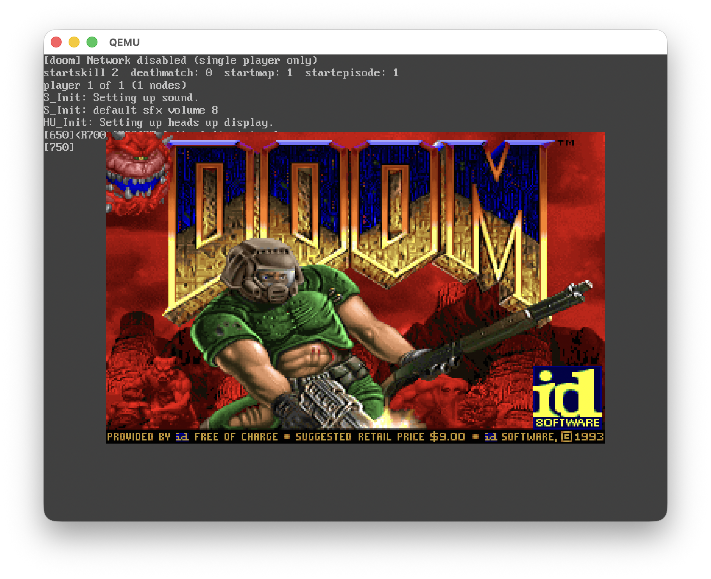
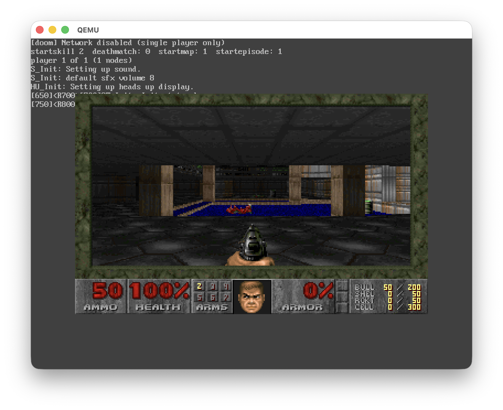

# Kenix

<p align="center">
  
  
</p>

A microkernel written in Rust for AArch64, featuring L4-style synchronous IPC,
user-space device drivers, and a VFS layer with FAT32 support.

## Current Status

The kernel boots on QEMU virt and runs multiple user-space servers:
- **Console server** - UART driver, handles stdin/stdout, forwards to framebuffer
- **VFS server** - Virtual filesystem with ramfs and FAT32
- **Block device server** - VirtIO-blk driver
- **Network device server** - VirtIO-net driver
- **Pipe server** - Blocking pipes with deferred IPC replies
- **Framebuffer server** - VirtIO-GPU or ramfb with text console (800x600)
- **Keyboard server** - VirtIO-input driver for GUI keyboard input
- **Init process** - System startup and shell launching

**Phase 3 Complete:** BusyBox shell runs interactively! The kernel now includes
alignment fault emulation for SIMD instructions, allowing unmodified musl-based
binaries to run. Type commands at the `/ #` prompt.

**DOOM runs on Kenix! (2026-02-10)**
The original DOOM (linuxdoom-1.10) has been ported to run on Kenix. Renders at
320x200 scaled 2x on the framebuffer with keyboard input via non-blocking console IPC.

**Recent Changes (2026-02-10):**
- **DOOM port:** Classic DOOM runs with framebuffer graphics and keyboard input
- **Non-blocking console read:** Added MSG_READ_NONBLOCK for game loops that poll input
- **Arrow key support:** Terminal escape sequence parsing (ESC [ A/B/C/D)
- **SYS_LSEEK:** File seeking with VFS integration
- **Cross-task page faults:** Kernel can now fault in pages for blocked tasks during
  IPC reply, fixing crashes when copying data to unmapped mmap regions
- **64-bit defaults fix:** Fixed memory corruption in DOOM's config system caused by
  writing 8-byte intptr_t values to 4-byte int locations on ARM64

**Previous Fixes (2026-02-08):**
- Framebuffer output for shell via console server IPC
- Fixed sys_writev bypassing console server
- Fixed fbdev/shell race condition with init synchronization
- Blocking pipes via deferred IPC replies
- Address space memory corruption fix for fork+execve
- Relative path resolution in execve

Tested features: IPC, shared memory, blocking pipes, file operations, process spawn/execve,
fork/wait, mmap/munmap (anonymous and file-backed), clock_gettime, signal delivery,
writev/readv, FAT32 disk I/O, interactive shell (ppoll blocking on stdin).

## Target

- QEMU virt (dev)
- Raspberry Pi 4/5 (planned)
- ARM Chromebook (planned)

## Prerequisites

```bash
# Rust nightly
rustup override set nightly
rustup component add rust-src

# QEMU
brew install qemu  # macOS
apt install qemu-system-aarch64  # Linux

# mtools (for FAT32 disk images)
brew install mtools  # macOS
apt install mtools   # Linux
```

## Build & Run

```bash
# Build the kernel and user-space programs
make

# Run on QEMU (serial console only)
make run-kernel

# Run with graphical display (shows framebuffer)
make run-kernel-fb

# BusyBox shell will display "/ #" prompt
# Type commands like: echo hello, ls, cat /etc/passwd
# Press Ctrl+A X to exit QEMU
```

### Running DOOM

```bash
# Copy DOOM and WAD file to disk image (already done if using provided disk.img)
mcopy -o -i disk.img user/doom/doom.elf ::/doom
mcopy -o -i disk.img doom1.wad ::/doom1.wad

# Run with framebuffer
make run-kernel-fb

# In shell:
/ # /disk/doom -iwad /disk/doom1.wad
```

Controls: WASD/Arrows=move, F=fire, E/Space=use, Q=strafe, 1-7=weapons, ESC=menu

### Sample Output

```
[console] Server started
[vfs] Server started
[blkdev] VirtIO ready
[netdev] MAC: 52:54:00:12:34:56
[pipeserv] ok, ready!

=== Kenix Init ===
[vfs] Block device connected
[vfs] FAT32 filesystem mounted at /disk/
--- Starting BusyBox Shell ---
shell pid=7
/ # export PATH=/disk/bin
/ # ls
disk       hello.txt  test.txt
/ # ls /disk
BIN        DATA       HELLO.TXT  TEST.TXT
/ # cat /hello.txt
Hello!
/ # exit

=== Init complete ===
```

## Project Structure

```
kenix/
├── boot/               # UEFI bootloader
├── kernel/             # Microkernel core
│   └── src/
│       ├── main.rs        # Kernel entry point
│       ├── mm/            # Memory management (paging, frames)
│       ├── sched/         # Scheduler and task management
│       ├── exception/     # Exception/interrupt handling
│       ├── ipc.rs         # IPC syscalls
│       ├── shm.rs         # Shared memory
│       ├── syscall.rs     # Syscall dispatcher
│       ├── gic.rs         # ARM GIC driver
│       ├── timer.rs       # ARM timer driver
│       ├── elf.rs         # ELF loader
│       ├── irq.rs         # IRQ-to-task routing
│       ├── signal.rs      # Signal delivery and handling
│       └── mmap.rs        # Anonymous mmap with demand paging
├── user/               # User-space programs (all Rust)
│   ├── libkenix/          # Shared runtime library
│   │   ├── Cargo.toml
│   │   └── src/lib.rs        # Syscalls, IPC, SHM wrappers
│   ├── console/           # Console server
│   │   ├── Cargo.toml
│   │   └── src/main.rs       # UART driver, IPC message loop
│   ├── init/              # Init process
│   │   ├── Cargo.toml
│   │   └── src/main.rs       # System tests, VFS client
│   ├── vfs/               # VFS server
│   │   ├── Cargo.toml
│   │   └── src/
│   │       ├── main.rs       # VFS server, mount points
│   │       ├── blk_client.rs # Block device IPC client
│   │       └── fat32/        # FAT32 filesystem
│   ├── blkdev/            # Block device server
│   │   ├── Cargo.toml
│   │   └── src/
│   │       ├── main.rs       # IPC server loop
│   │       ├── virtio_mmio.rs # VirtIO MMIO registers
│   │       ├── virtqueue.rs  # Virtqueue management
│   │       └── blk.rs        # VirtIO-blk protocol
│   ├── netdev/            # Network device server
│   │   ├── Cargo.toml
│   │   └── src/
│   │       ├── main.rs       # IPC server loop
│   │       ├── virtio_mmio.rs # VirtIO MMIO registers
│   │       ├── virtqueue.rs  # Virtqueue management
│   │       └── net.rs        # VirtIO-net protocol
│   ├── fbdev/             # Framebuffer device server
│   │   ├── Cargo.toml
│   │   └── src/
│   │       ├── main.rs       # IPC server loop, backend selection
│   │       ├── virtio_gpu.rs # VirtIO-GPU driver (preferred)
│   │       ├── ramfb.rs      # ramfb driver (fallback)
│   │       ├── fwcfg.rs      # QEMU fw_cfg interface
│   │       └── font.rs       # 8x16 VGA bitmap font, text console
│   ├── kbdev/             # Keyboard device server
│   │   ├── Cargo.toml
│   │   └── src/
│   │       ├── main.rs       # IPC server, keyboard polling
│   │       └── input.rs      # VirtIO-input driver
│   ├── pipeserv/          # Pipe server (blocking pipes via deferred IPC)
│   │   ├── Cargo.toml
│   │   └── src/main.rs
│   ├── hello/             # Test program for spawn
│   │   ├── Cargo.toml
│   │   └── src/main.rs
│   ├── forktest/          # Phase 1 BusyBox support tests
│   │   ├── Cargo.toml
│   │   └── src/main.rs
│   ├── user.ld            # Shared linker script
│   ├── aarch64-kenix-user.json  # Custom target spec
│   └── Cargo.toml         # Workspace root
├── docs/               # Documentation
│   ├── syscalls.md        # System call reference
│   ├── ipc-protocols.md   # IPC message formats
│   └── journal/           # Development notes
├── scripts/            # Build scripts
│   └── create_disk.sh     # FAT32 disk image creation
└── Makefile
```

## Signal Handling

Kenix implements POSIX-style signals with user-space signal handlers:

### Signal Delivery Flow

1. **Signal sent** - `kill(pid, sig)` or automatic (e.g., SIGCHLD on child exit)
2. **Signal queued** - Added to target task's `pending_signals` bitmask
3. **Delivery check** - Before returning to user-space, kernel checks for deliverable signals
4. **Handler setup** - If handler installed:
   - Save current user context to signal stack
   - Set up `siginfo_t` and `ucontext_t` on user stack
   - Redirect execution to user's signal handler
   - Return address set to `sigreturn` trampoline
5. **Handler runs** - User-space handler executes
6. **sigreturn** - Handler returns via `rt_sigreturn` syscall
7. **Context restore** - Kernel restores original context, resumes interrupted code

### Supported Signals

| Signal | Number | Default Action | Notes |
|--------|--------|----------------|-------|
| SIGHUP | 1 | Terminate | |
| SIGINT | 2 | Terminate | Ctrl+C |
| SIGQUIT | 3 | Terminate | |
| SIGKILL | 9 | Terminate | Cannot be caught |
| SIGPIPE | 13 | Terminate | Broken pipe |
| SIGCHLD | 17 | Ignore | Child exited |
| SIGCONT | 18 | Continue | |
| SIGSTOP | 19 | Stop | Cannot be caught |

### Example: Installing a Signal Handler

```c
void handler(int sig) {
    write(1, "Got signal!\n", 12);
}

struct sigaction sa = {
    .sa_handler = handler,
    .sa_flags = 0,
};
sigaction(SIGINT, &sa, NULL);
```

## Roadmap

### Core Kernel
- [x] UEFI boot
- [x] UART output
- [x] Physical memory management (frame allocator)
- [x] Paging (MMU, 2MB blocks)
- [x] 4KB page support (L3 tables)
- [x] Exception handler
- [x] Preemptive scheduler (round-robin, timer-based)

### User Space
- [x] User-space tasks (EL0)
- [x] ELF loader
- [x] Syscall interface
- [x] Pure Rust user-space (libkenix)

### IPC
- [x] Synchronous IPC (call/recv/reply)
- [x] Deferred replies (reply_to for async patterns)
- [x] Inline message passing (24 bytes)
- [x] Shared memory IPC
- [x] Asynchronous notifications (notify/wait_notify)

### Servers
- [x] Console server (UART + framebuffer forwarding)
- [x] VFS server (ramfs + FAT32)
- [x] Block device server (VirtIO-blk)
- [x] Network device server (VirtIO-net)
- [x] Framebuffer server (VirtIO-GPU or ramfb with text console)
- [x] Keyboard server (VirtIO-input for GUI keyboard)
- [x] Pipe server (blocking pipes with deferred replies)
- [x] FAT32 filesystem

### File Descriptors
- [x] Per-task fd table
- [x] stdin/stdout/stderr
- [x] read() syscall
- [x] write() syscall
- [x] close() syscall
- [x] lseek() syscall
- [x] pipe() syscall (blocking pipes via pipeserv)
- [x] dup/dup2/dup3 syscalls

### Process Management
- [x] spawn() syscall (create process from ELF in memory)
- [x] execve() syscall (execute program from VFS path)
- [x] getpid() syscall
- [x] exit() syscall
- [x] brk() syscall (heap management)
- [x] getcwd/chdir syscalls (working directory)
- [x] fork() syscall (copy-on-write not yet implemented, full copy)
- [x] wait/waitpid syscalls

### Memory Management
- [x] Anonymous mmap/munmap with demand paging
- [x] mprotect (stub)
- [x] File-backed mmap (pre-faulted)
- [ ] Copy-on-write (COW)
- [ ] Swapping

### Signals
- [x] Signal state tracking (mask, pending, handlers)
- [x] sigaction syscall (install signal handlers)
- [x] sigprocmask syscall (block/unblock signals)
- [x] kill syscall (send signal to process)
- [x] SIGCHLD delivery on child exit
- [x] Signal delivery to user-space handlers
- [x] sigreturn syscall (return from signal handler)
- [x] Default signal actions (terminate, ignore)
- [x] SA_RESTART, SA_SIGINFO flags (partial)

### Phase 2 musl/BusyBox Support
- [x] set_tid_address syscall
- [x] getrandom syscall
- [x] prlimit64 syscall
- [x] writev/readv syscalls
- [x] ioctl TIOCGWINSZ (terminal size)
- [x] ppoll syscall (blocking stdin)
- [x] getpgid/setpgid syscalls
- [x] fstatat syscall
- [x] SIMD alignment fault emulation (unmodified musl binaries work)

### Time
- [x] clock_gettime (CLOCK_MONOTONIC, CLOCK_REALTIME)
- [ ] nanosleep
- [ ] timer_create/timer_settime

### Hardware Support
- [x] VirtIO-blk driver (block device)
- [x] VirtIO-net driver (network)
- [x] VirtIO-GPU driver (framebuffer with 2D acceleration)
- [x] VirtIO-input driver (keyboard)
- [x] ramfb driver (framebuffer via fw_cfg, fallback)
- [x] ARM GIC (Generic Interrupt Controller)
- [x] ARM timer interrupts (preemption)
- [ ] VirtIO interrupt-driven I/O
- [ ] Raspberry Pi 4/5 support
- [ ] ARM Chromebook support

### Security & Robustness
- [ ] Capability-based security
- [ ] Resource limits
- [ ] Watchdog / task monitoring

### Developer Experience
- [ ] GDB stub for kernel debugging
- [ ] Kernel symbols for crash dumps
- [ ] Performance tracing
